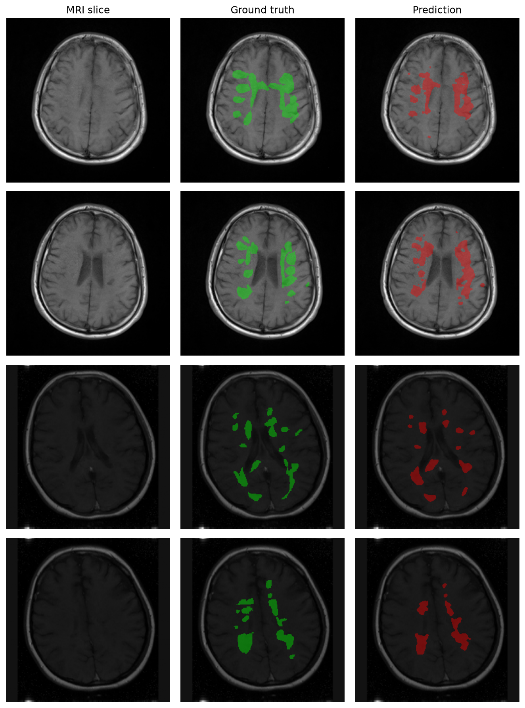
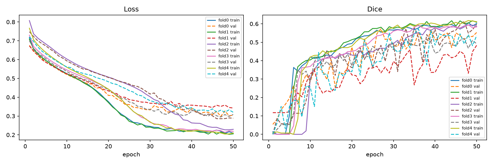

# MS Lesion Segmentation

A 2D U-Net that segments multiple sclerosis (MS) lesions in brain MRI (T1/T2/FLAIR), trained
end-to-end on GPU with patient-level 5-fold cross-validation. MS is diagnosed and monitored largely
through counting and tracking these lesions on MRI — manual segmentation is slow and has real
inter-rater variability, which is the practical motivation for automating it.

**Result**: Dice 0.553 ± 0.051 across 5 folds (60 patients). See
[Results](#results) below and the full critical analysis in
[`notebooks/03_results_report.ipynb`](notebooks/03_results_report.ipynb).

> **This is a research/educational project, not a clinical tool.** It has not been validated
> externally, was trained on a single 60-patient public dataset from ~20 centers, and should not be
> used to inform any real diagnostic or treatment decision. See [Limitations](#limitations--future-work).

## Results





| Metric | Mean ± std (5-fold) |
|---|---|
| Dice | 0.553 ± 0.051 |
| IoU | 0.433 ± 0.042 |
| Sensitivity | 0.578 ± 0.040 |
| Precision | 0.661 ± 0.027 |

## Project structure

```
data/            raw NIfTI downloads and preprocessed 2D slices (gitignored)
notebooks/       EDA, preprocessing dev, results report
src/data/        download + preprocessing (N4 bias correction, resampling) + PyTorch Dataset/split
src/models/      2D U-Net
src/utils/       metrics (Dice/IoU/sensitivity/precision) and visualization
src/train.py     training loop (config-driven, device-agnostic)
src/evaluate.py  cross-fold evaluation + prediction figures
configs/         hyperparameters (baseline.yaml)
outputs/         checkpoints (gitignored) and figures (versioned)
docs/            GPU setup details (AMD ROCm / NVIDIA CUDA)
.kaggle/         project-local Kaggle API token (gitignored, see below)
```

## Quickstart

```
python -m venv .venv-rocm   # or .venv -- see docs/SETUP_GPU.md for GPU-specific setup (AMD ROCm / NVIDIA)
.venv-rocm\Scripts\activate
pip install -r requirements.txt

python src/data/download.py                        # -> data/raw/
python src/data/preprocessing.py                    # -> data/processed/ (2D slices + index.csv)
python src/train.py --config configs/baseline.yaml  # -> outputs/checkpoints/
python src/evaluate.py --config configs/baseline.yaml  # -> outputs/figures/
```

**GPU setup** (required for a full run in reasonable time) is hardware-specific — see
[`docs/SETUP_GPU.md`](docs/SETUP_GPU.md) for AMD ROCm (what this project used) and NVIDIA CUDA
instructions. Without a GPU, everything still runs on CPU via the smoke test below.

`configs/baseline.yaml` runs the full 5-fold cross-validation by default (`folds_to_run: [0,1,2,3,4]`).

`preprocessing.py` options (all optional):
- `--skip-bias-correction` — skip N4 bias field correction (faster; useful for smoke tests).
- `--neg-ratio 1.5` — cap lesion-free slices per patient at this multiple of that patient's
  lesion-containing slice count (pass a negative value to disable and keep every brain slice).
- `--seed 42` — seed for the empty-slice subsampling.
- `--patient-limit N` — for smoke tests.

### Smoke test (fast, CPU-friendly)

```
python src/data/preprocessing.py --patient-limit 4 --skip-bias-correction
python src/train.py --config configs/baseline.yaml --smoke-test
python src/evaluate.py --config configs/baseline.yaml --smoke-test
```

Runs on 4 patients / 2 epochs to validate the full pipeline end-to-end before launching a real run.

## Kaggle API credentials

`src/data/download.py` uses the `kaggle` CLI (v2.x), which needs an API token. Kaggle's current token
format (`KGAT_...`) is read from an `access_token` file, resolved via `KAGGLE_CONFIG_DIR` (defaults to
`~/.kaggle`).

This repo scopes it to the project instead of your global `~/.kaggle`:
`.venv-rocm\Scripts\Activate.ps1` sets `KAGGLE_CONFIG_DIR` to `<project root>\.kaggle` automatically
on activation.

1. Go to your Kaggle account → Settings → API → **Create New Token**.
2. Save the token value into `.kaggle/access_token` at the project root (create the folder if needed):
   ```
   echo YOUR_TOKEN > .kaggle/access_token
   ```
3. Never commit this file — `.kaggle/` is already in `.gitignore`.

(The classic `kaggle.json` with `KAGGLE_USERNAME`/`KAGGLE_KEY` still works too, if you have one from an
older token.)

## Inference on a new patient

Once you have trained checkpoints (`outputs/checkpoints/fold{0-4}_best.pt`), you can run the model
on any patient folder that contains T1, T2, and FLAIR NIfTI files:

```
# Ensemble of all 5 folds (recommended — soft probability average before thresholding)
python src/predict.py \
  --patient-dir data/raw/patient_001 \
  --config configs/baseline.yaml \
  --ensemble \
  --out-dir outputs/predictions/patient_001/

# Single checkpoint
python src/predict.py \
  --patient-dir data/raw/patient_001 \
  --checkpoint outputs/checkpoints/fold0_best.pt

# Skip N4 bias correction for a quick test
python src/predict.py --patient-dir data/raw/patient_001 --ensemble --skip-bias-correction
```

Outputs written to `--out-dir`:
- `pred_mask.nii.gz` — 3D binary lesion mask in the FLAIR-resampled space
- `overlay.png` — grid of lesion-positive slices with prediction overlay in red
  (3-column with ground-truth overlay if a mask file is found, 2-column otherwise)
- `summary.json` — slice counts, total lesion voxels, Dice (only if ground-truth mask present)

The script applies the same N4 bias correction and FLAIR-space resampling as the training
preprocessing. If no ground-truth mask is found in the patient folder, it runs in
prediction-only mode without computing Dice.

## Notebooks

- `01_eda.ipynb` — inspect volumes, visualize modalities + lesion masks, lesion burden distribution.
- `02_preprocessing_dev.ipynb` — debug preprocessing on 2-3 patients before running it on all 60.
- `03_results_report.ipynb` — training curves, metrics table, prediction overlays, **critical
  analysis of results, and prioritized future-improvement notes** (start here for the full story
  behind the headline numbers).

## Method notes

- **Task**: 2D axial-slice binary segmentation (lesion vs. background) with a from-scratch U-Net.
- **Modalities**: T1/T2/FLAIR are *not* co-registered in this dataset (each has its own native
  resolution/slice count per patient) — `preprocessing.py` N4-corrects each modality in its own
  space (`SimpleITK`), then resamples onto the reference (FLAIR) grid via `scipy.ndimage.zoom` (a
  proportional approximation, not true anatomical registration).
- **Class balance**: lesion pixels are a small minority even within lesion-containing slices;
  `preprocessing.py` caps lesion-free slices per patient to reduce slice-level imbalance, and
  training uses a combined Dice + BCE loss.
- **Split**: patient-level k-fold (default 5-fold) — slices from the same patient never span
  train/val within a fold, enforced by an assertion in `src/data/dataset.py`.
- **Metrics**: Dice, IoU, sensitivity, precision, reported per fold and as mean ± std across folds.

## Limitations & future work

Full analysis with numbers in [`notebooks/03_results_report.ipynb`](notebooks/03_results_report.ipynb):

- Fold-to-fold variance is still the main source of uncertainty, not fully explained by data alone.
- Pixel-level lesion prevalence is ~0.35% even in lesion-containing slices — an imbalance-aware loss
  (focal/Tversky) is the most promising next lever, especially for sensitivity.
- The modality resampling is an approximation; true anatomical registration (SimpleITK/ANTs) is the
  single change most likely to reduce noise further.
- No held-out test set outside the 5-fold CV, and no external multi-center validation yet.
- 2D per-slice segmentation ignores inter-slice continuity; 2.5D/3D is a natural next step.

## Dataset & license

Trained on [`orvile/multiple-sclerosis-brain-mri-lesion-segmentation`](https://www.kaggle.com/datasets/orvile/multiple-sclerosis-brain-mri-lesion-segmentation)
(Kaggle), 60 patients, T1/T2/FLAIR + consensus lesion masks from ~20 centers, licensed
[CC BY 4.0](https://creativecommons.org/licenses/by/4.0/). The dataset itself is not redistributed
in this repo (`data/` is gitignored) — download it yourself via `src/data/download.py`.

Code in this repository is licensed under the [MIT License](LICENSE).
